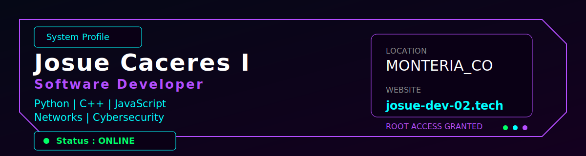

<div align="center">
  
</div>

---

Software Developer & IT Specialist focused on Python, Linux, cybersecurity, networking, and modern web technologies. Passionate about building real-world solutions, scalable systems, and continuously learning new technologies.

---

## `$ ls skills/`

**Lenguajes**


**Web & Frameworks**


**Sistemas & Redes**


**Seguridad**


---

## `$ cat projects/`

| Proyecto | Stack | Demo |
|---|---|---|
| 🖥️ **Interactive Terminal Style CV** | `HTML` `CSS` `JS` `SVG` | [→ Live](https://josue-dev-0210.github.io/Interactive-Terminal-Style-CV/) |
| 📊 **Vuln Manager JC** | `JS` `CSS` `HTML` | [→ Clone](https://github.com/Josue-Dev-0210/Vuln-Manager-JC) |
| 🌐 **Net Scanner JC** | `Canvas API` `SVG` `JS` | [→ Live](https://josue-dev-0210.github.io/Network-Scanner-Visual/) |
| 🔢 **Calculadora Subredes JC** | `JS` `SheetJS` `jsPDF` | [→ Live](https://josue-dev-0210.github.io/Calculadora-de-Subredes/) |
| 🔐 **Password Tester JC** | `JS` | [→ Live](https://josue-dev-0210.github.io/Password-tester-JC/) |
| 🐧 **Linuxdex** | `HTML` `CSS` `JS` | [→ Live](https://josue-dev-0210.github.io/Linuxdex/) |

---

## `$ cat certifications/`

<div align="center">


</div>

---

## `$ git log --stats`

<div align="center">


</div>

<div align="center">


</div>

---

## `$ ping contact`

<div align="center">

[](https://josue-dev-02.tech)
[](mailto:Josue.dev.0210@gmail.com)

```
  Available for freelance projects & remote oportunities
```

</div>

---

<div align="center">
  
</div>
